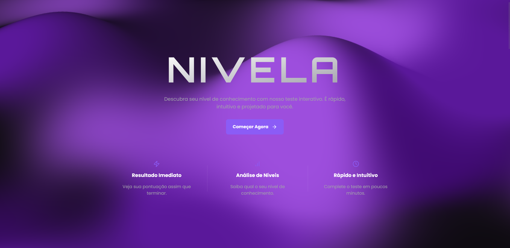

# Nivela - Plataforma de Nivelamento de Idiomas




## 🚀 Sobre o Projeto

**Nivela** é uma plataforma web interativa projetada para avaliar a proficiência de usuários em diferentes idiomas (inglês, espanhol e francês). O projeto foi desenvolvido como um case de estudo para aprofundar conhecimentos em tecnologias de front-end modernas, com foco especial em design de interface, experiência do usuário e animações dinâmicas.

A jornada de desenvolvimento passou por múltiplas iterações, evoluindo de um teste simples para uma experiência de produto completa, com uma landing page persuasiva e uma interface fluida e "sem cards", que reage ao scroll do usuário.

## ✨ Features Principais

-   **Teste Multi-idioma:** Suporte para testes de nivelamento em Inglês, Espanhol e Francês.
-   **Design Moderno e Responsivo:** Uma estética "all black" profissional com layouts fluidos que se adaptam a qualquer tela.
-   **Animações Avançadas:** Uso intensivo de **Framer Motion** para:
    -   Transições de página suaves.
    -   Animações de entrada escalonadas (stagger).
    -   Efeitos de scroll (parallax, linhas de SVG que se desenham, etc).
-   **Fundo Dinâmico:** Background interativo e animado que cria uma experiência imersiva.
-   **Lógica de Nivelamento Precisa:** O resultado do teste é calculado com base em uma pontuação que corresponde aos níveis do CEFR (A1 a C1).
-   **Componentização com React:** Código limpo e organizado, seguindo as melhores práticas de desenvolvimento.

## 🛠️ Tecnologias Utilizadas

O projeto foi construído utilizando as seguintes tecnologias e bibliotecas:


-   **Next.js:** Framework React para produção.
-   **React:** Biblioteca para construção de interfaces.
-   **TypeScript:** Para um código mais seguro e robusto.
-   **Tailwind CSS:** Para estilização rápida e moderna
-   **Framer Motion:** Para a criação de todas as animações complexas.
-   **Lucide React:** Para os ícones.
-   **Whatamesh**: Para o efeito de fundo dinâmico

## ⚙️ Como Rodar o Projeto Localmente

Para executar o projeto na sua máquina, siga os passos abaixo:

```bash
# 1. Clone o repositório
git clone [https://github.com/athomasmariano/nivela-app](https://github.com/athomasmariano/nivela-app.git)

# 2. Navegue até a pasta do projeto
cd nivela

# 3. Instale as dependências
npm install

# 4. Inicie o servidor de desenvolvimento
npm run dev
```
Abra [http://localhost:3000](http://localhost:3000) no seu navegador para ver o resultado.

---

Criado por **[Arthur Thomas Mariano]** - [https://www.linkedin.com/in/arthur-thomas-941a97234](https://www.linkedin.com/in/arthur-thomas-941a97234)
